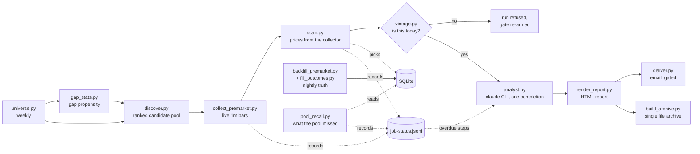

# PremarketDesk

A single machine, single user premarket desk for US equities. Every weekday
morning it builds a watchlist, listens to the live premarket tape, scores the
candidates, has a language model write the narrative, and delivers one HTML
report before the open. Every evening it goes back and checks itself against
the vendor's published record.

The design has one brain and one voice: **Python decides, the model narrates.**
Membership, scores, and conviction come from code reading explicit thresholds.
The model only turns an already finished evidence packet into readable prose,
and a checker verifies the prose invented nothing.

## The hard rules

These are load bearing. The code enforces them; changing them means changing
the design, not a config value.

1. **One data source.** Every market number comes from EODHD All-In-One
   (REST and the US trades websocket). Nothing is fetched from anywhere else.
2. **Every threshold lives in `doc/CRITERIA.md`.** The strict reader in
   `src/core/criteria.py` raises on a missing key, and no decision literal is
   allowed in Python. To retune the system you edit a markdown file.
3. **The narrative pass uses the claude CLI as a subprocess**, authenticated
   by a logged in Claude subscription. There is no Anthropic SDK anywhere,
   and `src/core/config.py` actively refuses to read or pass `ANTHROPIC_API_KEY`.
4. **Missing evidence stays missing.** A field the pipeline could not get is
   null with a recorded reason. It is never filled from another day, another
   source, or a guess.
5. **Premarket high, low, and VWAP come from the project's own collector.**
   The vendor's published intraday bars are used at night to audit the
   collector, written into separate `_true` columns, never over the morning
   values. Their disagreement is itself a recorded measurement.

## A day in the life

All times are US Eastern, which the machine is expected to keep locally.

| Time | Job | What it does |
| --- | --- | --- |
| Sun 21:00 | universe | Weekly rebuild of the discovery universe, then the gap propensity sweep over every name in it, one counted call per name, measured at 2,745 calls and 421 seconds on the 2026-08-13 universe. That propensity is what discovery ranks the pool by inside each tier. 21:00 and not 20:00: 20:00 ET is the instant of the 00:00 UTC quota reset in daylight time, so the largest job in the schedule billed to whichever quota day it happened to land on |
| 07:00 | nightly-catchup | The nightly's vendor lag half, the same .bat called with the argument "catchup": calendar refresh, backfill, outcomes, then stop. The vendor usually publishes yesterday's intraday overnight, so this fills anything the 22:15 run could not. Pool recall and the archive rebuild are skipped, because pool_recall measures the session it is invoked on and at 07:00 that session has not opened |
| 07:15 | discover | Builds today's candidate pool from four priors, ranks it, subscribes the collector to the top of it, warms the volume baseline |
| 07:20 to 09:25 | collector | Websocket trades to one minute bars on disk, one file per day |
| 07:25, every 30 min | monitor | The watchdog: checks each job fired and finished, reruns what is safe |
| 08:45 | morning chain | scan, analyst, render, verify, deliver, archive, stopping at the first failure. verify is the exception: it prints the gate table for a human and never stops the chain, because the gate is enforced by deliver |
| 22:15 | nightly | Refreshes the cached exchange calendar so the 08:45 chain never fetches it, backfills the true premarket window, fills trade outcomes, measures what the morning's pool missed into `runs/YYYY-MM-DD/pool_recall.json`, rebuilds the archive |
| 22:45 | monitor-night | The watchdog once more, over the nightly |
| Every 30 min, all day, every day | meter-sampler | One reading of the shared EODHD quota counter into `logs/meter-<quota day>.log`, 48 a day, weekends included. Not a pipeline step: an instrument. The job trail says which step spent what and cannot say when, and nothing at all runs between 22:45 and 07:00, which is exactly where a sibling project draining the shared key would hide |



Every step in that diagram, and every other step a `.bat` runs, appends its
outcome to `data/job-status.jsonl` as it exits. The analyst reads it back and
names anything overdue in the morning report, which is the one channel a human
reads every day. It exists because `pool_recall.py` raised NameError on every
nightly run for a week: its exit code is ignored by design so a diagnostic
cannot break the chain, and nothing recorded that it had failed.

Every weekday job first runs `src/ops/market_today.py`, a trading day guard built
on the cached EODHD exchange calendar. It exits 3 on a weekend or an official
holiday and the calling `.bat` logs one line and stops cleanly, so the tasks
stay registered plain Monday to Friday and holidays take care of themselves.
Two jobs run no guard. The Sunday universe rebuild does not, because that guard
counts Sunday as a non trading day, so wiring it in would skip the weekly
rebuild every week, and the rebuild is what keeps the following week alive. The
meter sampler does not either, because the counter it reads is shared with
everything else using the token and rolls at midnight UTC, so a day this market
is closed is exactly a day a drain would otherwise go unrecorded.

## What you need

- **Windows 10 or 11.** Scheduling is Windows Task Scheduler plus the `.bat`
  files in `tasks/`. The pipeline itself is portable Python, but the provided
  automation is Windows.
- **Python 3.11 or newer** (developed on 3.14.7). Dependencies are deliberately
  tiny: `requests`, `websocket-client`, `markdown`.
- **An EODHD All-In-One subscription** and its API token. Lower EODHD tiers
  do not include the trades websocket that the collector needs.
- **The claude CLI, signed in to a Claude subscription** (Pro or Max). Install
  with `npm install -g @anthropic-ai/claude-code`, run `claude` once to log
  in. The analyst step shells out to it for exactly one completion per
  market day. No API key is used or wanted.
- **Optional: a Resend account** if you want the report emailed. Without it,
  delivery skips cleanly and the report still lands on disk.
- The machine must be **awake and on US Eastern time** during the premarket
  window. Task Scheduler triggers are machine local time; if your machine
  keeps another zone, re-derive the times in `tasks/register_tasks.ps1` from
  the clocks in `doc/CRITERIA.md` before registering. The Python code itself
  computes Eastern time internally (`src/core/ettime.py`) regardless of the
  machine zone.

## Setup

1. **Clone and create the venv at the project root.** The `.bat` jobs
   hardcode `.venv\Scripts\python.exe`, so the name and place matter:

   ```
   git clone https://github.com/masalasev-ops/PremarketDesk.git
   cd PremarketDesk
   python -m venv .venv
   .venv\Scripts\pip install -r requirements.txt
   ```

2. **Configure.** Copy `.env.example` to `.env` and fill in
   `EODHD_API_TOKEN`. Leave the Resend keys blank for now; you want the
   verification gate (below) to pass before any email goes out.

3. **Self check.** This creates the working directories and prints the project
   root, whether `ANTHROPIC_API_KEY` is set anywhere (it must not be), the
   masked EODHD token, whether the Resend keys are set, and the dependency
   versions:

   ```
   set PYTHONPATH=%CD%\src
   .venv\Scripts\python.exe -m core.config
   ```

4. **Arm the delivery gate.** This creates `data\UNVERIFIED`, and
   `deliver.py` refuses to email while that file exists:

   ```
   .venv\Scripts\python.exe -m morning.verify_morning --arm
   ```

5. **Build the first universe, and the gap statistics that rank it.** Normally
   the Sunday job's work, and it is both halves: `job_universe.bat` runs the
   rebuild and then the propensity sweep over every name in it. Discovery ranks
   the pool inside each tier by `gap_propensity`, so a universe with no gap
   statistics behind it leaves discover with nothing to order by, and
   `[Discovery] min_ranked_fraction_to_subscribe` makes it write no watchlist
   and exit non zero rather than subscribe an arbitrary 42 names. The second
   command is the larger of the two: one counted call per universe name,
   measured at 2,745 calls and 421 seconds.

   ```
   .venv\Scripts\python.exe -m selection.universe
   .venv\Scripts\python.exe -m selection.gap_stats
   ```

6. **Register the scheduled jobs:**

   ```
   powershell -ExecutionPolicy Bypass -File tasks\register_tasks.ps1
   ```

   They appear in the Task Scheduler GUI under Task Scheduler Library >
   PremarketDesk. `-Unregister` removes them all. Do not register these by
   hand with `schtasks /Create`; its string quoting silently stores a spaced
   path unquoted and the task dies at fire time with 0x80070002. The script
   uses the PowerShell ScheduledTasks module, which stores the path
   structurally. Details and caveats are in `tasks/README.md`.

7. **Let a real morning run**, then read the gate table that
   `src/morning/verify_morning.py` prints into `logs\morning-chain-YYYY-MM-DD.log`.
   For the first three candidates it lays the evidence out on one line: the
   price and the minute it printed, the collector's premarket volume, the
   cached baseline median, the RVOL those two produce, and the bar count
   behind it, plus any candidate dropped for having no collector coverage.
   A price with no clock beside it cannot be checked by eye, which is the
   lesson of the first live morning. You can also run any step by hand in
   pipeline order; every script is idempotent and safe to rerun.

8. **Go live.** When a morning looks right: delete `data\UNVERIFIED`, put
   `RESEND_API_KEY` and `EMAIL_TO` into `.env`. The next morning's report
   arrives by email. Everything before this point is guaranteed to send
   nothing.

## Where things land

Everything generated at runtime is git ignored and created on demand:

| Path | What |
| --- | --- |
| `data/premarketdesk.db` | SQLite (WAL): the picks table, one row per (date, ticker), carrying the pool source and tier that put each name in front of the collector; the premarket volume baseline; and gap_stats, one row per (ticker, as_of) |
| `data/premarket/` | The collector's one minute bar files, its per run stats, and the subscription list it wrote at subscribe time so the 08:45 packet can tell a silent symbol from one that was never subscribed |
| `data/job-status.jsonl` | One line per scheduled step per run: job, step, start and end in ET, status, exception type, and one count of what it produced. Written in a `finally` block, so a step killed mid run records dying. The next morning's report names any step that has not succeeded inside its window |
| `data/universe.json`, `data/watchlist.json` | The weekly universe, and the day's whole ranked candidate pool rather than only the names being listened to. Up to `max_subscribed_candidates` rows are marked `subscribed`, and that is not simply the top 42: each populated tier takes `min_slots_per_tier` first. Everything below the cut stays in the file marked `not_subscribed`, so the cut is auditable |
| `runs/YYYY-MM-DD/` | The day's evidence packet, model transcript, rendered report, verification results |
| `logs/` | One log per job per day, every step ending in a `rc=N` marker line. Two files here are not that: `meter-<quota day>.log` is the shared quota trail, keyed by the vendor's quota day rather than the ET date because that is the day the counter actually resets on, and `meter-sampler.log` is the sampler's own undated stdout |
| `site/PremarketDesk.html` | The whole report history as one self contained file, newest sessions embedded, older ones linked. Opens from disk, no server, no network |

## Configuration reference

`doc/CRITERIA.md` is the single place every tunable number lives: scoring
weights, gap and RVOL thresholds, session clocks, the analyst model and its
measured timeout, watchdog rerun policy, archive depth. Each value carries
its reasoning in prose next to it. Edit it and the next run picks it up; get
a key wrong and the strict reader fails loudly rather than defaulting.

Other documents:

- `doc/CHANGELOG.md` records what changed and when, newest first, and
  `doc/DECISIONS.md` records why the choices that could have gone another
  way went the way they did. Both start at 2026-08-14.
- `doc/BUILD_PLAN.md` records how the system was built and verified,
  checkpoint by checkpoint, including the environment traps that were
  actually hit. Paths in it refer to the original build machine.
- `doc/ArchitecturePremarketdesk.html` and `doc/Premarketdesk_ADayRunArc.html`
  are the architecture pages; open them in a browser.
- `doc/REPORT_TEMPLATE.md` and `doc/prompt_analyst.md` are the report shape
  and the narrative instructions piped to the CLI.
- `doc/sample_report.html` is a hand built mock with invented data, kept
  because `runs/` and `site/` are gitignored and no real report is in the
  repository. It predates the settled template: its watchlist headers are the
  old ones, so a report shaped like it would be reported by the containment
  check as omitting both watchlist tables, and its footer records sonnet at low
  effort where `doc/CRITERIA.md` sets opus at medium. The shape the code
  actually produces is `doc/REPORT_TEMPLATE.md`.

## What it costs to run

- **EODHD:** the websocket collector was measured at zero against the
  vendor's own API counter (connections, subscribes, and reconnects
  included; `src/research/measure_socket_cost.py` reproduces the measurement). REST
  usage is a few hundred counted calls a day. Discovery spends up to three
  bulk end of day calls at a measured 100 credits each, two for the prior
  session movers source and one more for the third session close the
  briefing's two session leg is measured from, plus one earnings calendar
  call and up to five news calls; the baseline warm spends one
  intraday call per stale name; the 08:45 scan spends a few dozen across
  quotes, history and news; the nightly spends one intraday call per pick
  plus two bulk end of day calls for the pool recall measurement, today's
  session and the prior one. The weekly job
  is the largest single spend: the universe rebuild plus one call per name
  for gap propensity, measured at 2,745 on the 2026-08-13 universe. The jobs
  that spend before the open read the shared counter once on entry and act on
  what it says rather than discovering the limit through 429s: discover, the
  baseline warm that follows it, the 08:45 scan, and the Sunday universe and
  gap propensity sweeps, which refuse outright rather than start a sweep they
  cannot afford. The nightly does not preflight. The counter is account wide
  across everything using your token and resets at midnight UTC.
- **Claude:** one non agentic completion per market day (plus at most one
  retry), on the subscription. Measured at 48.4, 98.5 and 178.9 seconds of CLI
  time on the three scheduled mornings of 2026-08-17 to 2026-08-19, opus at
  medium reasoning effort, which is where the 537 second timeout in
  `doc/CRITERIA.md` comes from, three times the slowest. The rule has always
  been three times the slowest run on record; on 2026-08-20 what counts as a
  run on record moved from the five dry runs of 2026-08-14 to the scheduled
  mornings that overtook them. If the CLI fails or times out, the morning still ships:
  `analyst.py` falls back to a plain table report built from the packet and
  says so in the report itself.

## When things go wrong

- **The watchdog usually acts first.** `src/ops/monitor_jobs.py` reruns anything
  idempotent at most once per day, restarts a dead collector only while the
  premarket window is open and no collector is alive, and never reruns
  discovery after the collector starts. Its reasoning is in
  `logs\monitor-YYYY-MM-DD.log`.
- **Antivirus TLS interception** (Norton and similar re-sign HTTPS with
  their own root): `src/core/config.py` detects the local root and widens the
  trust store instead of turning verification off. The same suites
  occasionally deny a first file write; scripts retry, and a one line
  permission error in a log that still ends `rc=0` was a survived retry.
- **The vendor publishes intraday late.** EODHD's one minute bars for a day
  often appear only overnight, so the 22:15 backfill may find nothing. That
  is what the 07:00 catch-up run is for, and unfilled days are swept up for
  several sessions after. A day is only ever filled with its own data.
- **A failed morning is visible, not silent.** The chain stops at the first
  nonzero exit, the report falls back rather than fabricates, and the
  evening archive rebuild still captures whatever the day produced.

## Disclaimer

This is personal research tooling that summarizes market data. It is not
investment advice, and nothing it prints is a recommendation to trade.
