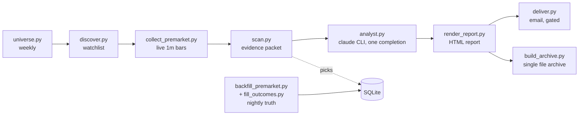

# PremarketDesk

A single machine, single user premarket desk for US equities. Every weekday
morning it builds a watchlist, listens to the live premarket tape, scores the
candidates, has a language model write the narrative, and delivers one HTML
report before the open. Every evening it goes back and checks itself against
the vendor's published record.

The design has one brain and one voice: **Python decides, the model narrates.**
Membership, scores, and conviction come from code reading explicit thresholds.
The model only turns an already finished evidence packet into readable prose,
and a checker verifies the prose invented nothing.

## The hard rules

These are load bearing. The code enforces them; changing them means changing
the design, not a config value.

1. **One data source.** Every market number comes from EODHD All-In-One
   (REST and the US trades websocket). Nothing is fetched from anywhere else.
2. **Every threshold lives in `doc/CRITERIA.md`.** The strict reader in
   `src/criteria.py` raises on a missing key, and no decision literal is
   allowed in Python. To retune the system you edit a markdown file.
3. **The narrative pass uses the claude CLI as a subprocess**, authenticated
   by a logged in Claude subscription. There is no Anthropic SDK anywhere,
   and `src/config.py` actively refuses to read or pass `ANTHROPIC_API_KEY`.
4. **Missing evidence stays missing.** A field the pipeline could not get is
   null with a recorded reason. It is never filled from another day, another
   source, or a guess.
5. **Premarket high, low, and VWAP come from the project's own collector.**
   The vendor's published intraday bars are used at night to audit the
   collector, written into separate `_true` columns, never over the morning
   values. Their disagreement is itself a recorded measurement.

## A day in the life

All times are US Eastern, which the machine is expected to keep locally.

| Time | Job | What it does |
| --- | --- | --- |
| Sun 20:00 | universe | Weekly rebuild of the discovery universe |
| 07:00 | nightly-catchup | The nightly again: the vendor usually publishes yesterday's intraday overnight, so this fills anything the 22:15 run could not |
| 07:15 | discover | Picks today's watchlist from the universe, warms the volume baseline |
| 07:20 to 09:25 | collector | Websocket trades to one minute bars on disk, one file per day |
| 07:25, every 30 min | monitor | The watchdog: checks each job fired and finished, reruns what is safe |
| 08:45 | morning chain | scan, analyst, render, deliver, archive, stopping at the first failure |
| 22:15 | nightly | Backfills the true premarket window, fills trade outcomes, rebuilds the archive |
| 22:45 | monitor-night | The watchdog once more, over the nightly |



Every job first runs `src/market_today.py`, a trading day guard built on the
cached EODHD exchange calendar, so weekends and holidays skip themselves and
the tasks stay registered plain Monday to Friday.

## What you need

- **Windows 10 or 11.** Scheduling is Windows Task Scheduler plus the `.bat`
  files in `tasks/`. The pipeline itself is portable Python, but the provided
  automation is Windows.
- **Python 3.11 or newer** (developed on 3.13). Dependencies are deliberately
  tiny: `requests`, `websocket-client`, `markdown`.
- **An EODHD All-In-One subscription** and its API token. Lower EODHD tiers
  do not include the trades websocket that the collector needs.
- **The claude CLI, signed in to a Claude subscription** (Pro or Max). Install
  with `npm install -g @anthropic-ai/claude-code`, run `claude` once to log
  in. The analyst step shells out to it for exactly one completion per
  market day. No API key is used or wanted.
- **Optional: a Resend account** if you want the report emailed. Without it,
  delivery skips cleanly and the report still lands on disk.
- The machine must be **awake and on US Eastern time** during the premarket
  window. Task Scheduler triggers are machine local time; if your machine
  keeps another zone, re-derive the times in `tasks/register_tasks.ps1` from
  the clocks in `doc/CRITERIA.md` before registering. The Python code itself
  computes Eastern time internally (`src/ettime.py`) regardless of the
  machine zone.

## Setup

1. **Clone and create the venv at the project root.** The `.bat` jobs
   hardcode `.venv\Scripts\python.exe`, so the name and place matter:

   ```
   git clone https://github.com/masalasev-ops/PremarketDesk.git
   cd PremarketDesk
   python -m venv .venv
   .venv\Scripts\pip install -r requirements.txt
   ```

2. **Configure.** Copy `.env.example` to `.env` and fill in
   `EODHD_API_TOKEN`. Leave the Resend keys blank for now; you want the
   verification gate (below) to pass before any email goes out.

3. **Self check.** This prints the masked token, the dependency versions,
   and the TLS trust decision, and creates the working directories:

   ```
   .venv\Scripts\python.exe src\config.py
   ```

4. **Arm the delivery gate.** This creates `data\UNVERIFIED`, and
   `deliver.py` refuses to email while that file exists:

   ```
   .venv\Scripts\python.exe src\verify_morning.py --arm
   ```

5. **Build the first universe.** Normally the Sunday job's work:

   ```
   .venv\Scripts\python.exe src\universe.py
   ```

6. **Register the scheduled jobs:**

   ```
   powershell -ExecutionPolicy Bypass -File tasks\register_tasks.ps1
   ```

   They appear in the Task Scheduler GUI under Task Scheduler Library >
   PremarketDesk. `-Unregister` removes them all. Do not register these by
   hand with `schtasks /Create`; its string quoting silently stores a spaced
   path unquoted and the task dies at fire time with 0x80070002. The script
   uses the PowerShell ScheduledTasks module, which stores the path
   structurally. Details and caveats are in `tasks/README.md`.

7. **Let a real morning run**, then read the gate table that
   `src/verify_morning.py` prints into `logs\morning-chain-YYYY-MM-DD.log`.
   It checks the day's evidence chain end to end. You can also run any step
   by hand in pipeline order; every script is idempotent and safe to rerun.

8. **Go live.** When a morning looks right: delete `data\UNVERIFIED`, put
   `RESEND_API_KEY` and `EMAIL_TO` into `.env`. The next morning's report
   arrives by email. Everything before this point is guaranteed to send
   nothing.

## Where things land

Everything generated at runtime is git ignored and created on demand:

| Path | What |
| --- | --- |
| `data/premarketdesk.db` | SQLite (WAL): the picks table, one row per (date, ticker), and the volume baseline |
| `data/premarket/` | The collector's one minute bar files and per run stats |
| `data/universe.json`, `data/watchlist.json` | The weekly universe and the day's watchlist |
| `runs/YYYY-MM-DD/` | The day's evidence packet, model transcript, rendered report, verification results |
| `logs/` | One log per job per day, every step ending in a `rc=N` marker line |
| `site/PremarketDesk.html` | The whole report history as one self contained file, newest sessions embedded, older ones linked. Opens from disk, no server, no network |

## Configuration reference

`doc/CRITERIA.md` is the single place every tunable number lives: scoring
weights, gap and RVOL thresholds, session clocks, the analyst model and its
measured timeout, watchdog rerun policy, archive depth. Each value carries
its reasoning in prose next to it. Edit it and the next run picks it up; get
a key wrong and the strict reader fails loudly rather than defaulting.

Other documents:

- `doc/BUILD_PLAN.md` records how the system was built and verified,
  checkpoint by checkpoint, including the environment traps that were
  actually hit. Paths in it refer to the original build machine.
- `doc/ArchitecturePremarketdesk.html` and `doc/Premarketdesk_ADayRunArc.html`
  are the architecture pages; open them in a browser.
- `doc/REPORT_TEMPLATE.md` and `doc/prompt_analyst.md` are the report shape
  and the narrative instructions piped to the CLI.
- `doc/sample_report.html` is what a finished morning report looks like.

## What it costs to run

- **EODHD:** the websocket collector was measured at zero against the
  vendor's own API counter (connections, subscribes, and reconnects
  included; `src/measure_socket_cost.py` reproduces the measurement). REST
  usage is a few hundred calls a day: discovery and baseline in the morning,
  one intraday call per pick in the nightly backfill, a weekly universe
  rebuild, a cached exchange calendar. The daily call counter is account
  wide across everything using your token, and it resets at midnight UTC.
- **Claude:** one non agentic completion per market day (plus at most one
  retry), on the subscription. Measured 65 to 78 seconds per report at low
  reasoning effort. If the CLI fails or times out, the morning still ships:
  `analyst.py` falls back to a plain table report built from the packet and
  says so in the report itself.

## When things go wrong

- **The watchdog usually acts first.** `src/monitor_jobs.py` reruns anything
  idempotent at most once per day, restarts a dead collector only while the
  premarket window is open and no collector is alive, and never reruns
  discovery after the collector starts. Its reasoning is in
  `logs\monitor-YYYY-MM-DD.log`.
- **Antivirus TLS interception** (Norton and similar re-sign HTTPS with
  their own root): `src/config.py` detects the local root and widens the
  trust store instead of turning verification off. The same suites
  occasionally deny a first file write; scripts retry, and a one line
  permission error in a log that still ends `rc=0` was a survived retry.
- **The vendor publishes intraday late.** EODHD's one minute bars for a day
  often appear only overnight, so the 22:15 backfill may find nothing. That
  is what the 07:00 catch-up run is for, and unfilled days are swept up for
  several sessions after. A day is only ever filled with its own data.
- **A failed morning is visible, not silent.** The chain stops at the first
  nonzero exit, the report falls back rather than fabricates, and the
  evening archive rebuild still captures whatever the day produced.

## Disclaimer

This is personal research tooling that summarizes market data. It is not
investment advice, and nothing it prints is a recommendation to trade.
