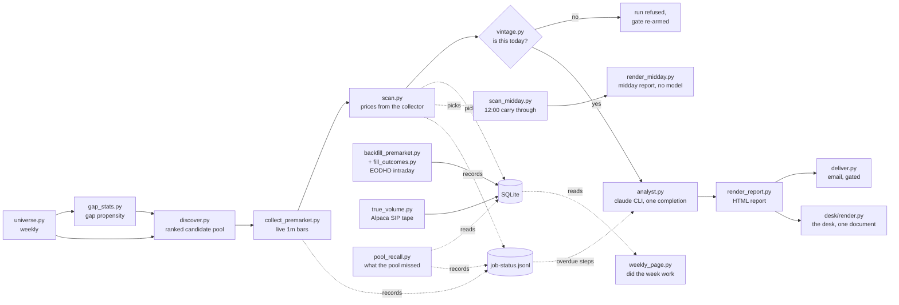

# PremarketDesk

A single machine, single user premarket desk for US equities. Every weekday
morning it builds a watchlist, listens to the live premarket tape, scores the
candidates, has a language model write the narrative, and delivers one HTML
report before the open. Every evening it goes back and checks itself against
what the vendors published.

The design has one brain and one voice: **Python decides, the model narrates.**
Membership, scores, and conviction come from code reading explicit thresholds.
The model only turns an already finished evidence packet into readable prose,
and a checker verifies the prose invented nothing.

## The hard rules

These are load bearing. The code enforces them; changing them means changing
the design, not a config value.

1. **One data source in the published path.** Every market number the morning
   publishes comes from EODHD All-In-One (REST and the US trades websocket).
   Exactly one scheduled step reads a second vendor, and it runs after the
   session is over: `night/true_volume.py`, inside the 22:15 nightly, measures
   what premarket volume actually was from Alpaca's full SIP tape. It writes
   its own columns beside the morning's and never over them, nothing the
   morning reads comes from it, and it spends no EODHD quota. See rule 5,
   `doc/CRITERIA.md [Truth]`, and `doc/ALPACA_PROBE.md` for why that vendor and
   why only at night.
2. **Every threshold lives in `doc/CRITERIA.md`.** The strict reader in
   `src/core/criteria.py` raises on a missing key, and no decision literal is
   allowed in Python. To retune the system you edit a markdown file.
3. **The narrative pass uses the claude CLI as a subprocess**, authenticated
   by a logged in Claude subscription. There is no Anthropic SDK anywhere,
   and `src/core/config.py` actively refuses to read or pass `ANTHROPIC_API_KEY`.
4. **Missing evidence stays missing.** A field the pipeline could not get is
   null with a recorded reason. It is never filled from another day, another
   source, or a guess.
5. **Premarket high, low, VWAP and volume come from the project's own
   collector.** The socket carries a fraction of the consolidated tape, so the
   morning's premarket volume is an estimate: the socket's count divided by
   `[Collector] premarket_capture_rate`. The night audits both halves and uses
   a different vendor for each. EODHD's published intraday bars fill
   `pm_high_true`, `pm_low_true` and `pm_vwap_true`; Alpaca's SIP tape fills
   the volume truth columns. All of it is written beside the morning's values,
   never over them, and `_true` is not a provenance: `truth_source` carries the
   vendor on every row. Their disagreement is itself a recorded measurement.

## A day in the life

All times are US Eastern, which the machine is expected to keep locally.

| Time | Job | What it does |
| --- | --- | --- |
| 03:55 and 07:15 | discover | Builds today's candidate pool from four priors (earnings between the prior close and this open, overnight news, prior session movers, recent runners), ranks it, subscribes the collector to the top of it, warms the volume baseline. Twice: 03:55 gives the 04:00 collector a pool to open on, 07:15 is the one the morning screens, over a news window that reaches the hours most earnings land in |
| 04:00 to 09:25 | collector | Websocket trades to one minute bars on disk, one file per day. Starts on the provisional pool the 03:55 discover wrote and moves onto the 07:15 pool at 07:20, keeping the tape of every name on both. See the two phase note in CRITERIA |
| 07:25 every 30 min to 09:25; 12:25, 12:55, 13:25; 22:45 | monitor | The watchdog, one task with three triggers: checks each job fired and finished, reruns what is safe. The morning trigger covers the collector, discover and the chain. The three midday passes watch the midday job, and there are three and not one because `job_log_stale_after_s` is 2,200 seconds: a midday that hung after writing its log at 12:00 is still warm at 12:25 and cannot be told from a live one, and is cold by 12:55. The midday job is the one job the watchdog reports and never reruns: the 12:00 sweep spends about 2,900 credits on the shared key, and a relaunch would replace the packet it may already have written. The 22:45 pass is over the nightly. Which pass a firing is comes from the clock, decided in `ops/monitor_jobs.py` from CRITERIA [Monitor] |
| 08:45 | morning chain | scan, analyst, render, verify, deliver, desk, stopping at the first failure. verify is the exception: it prints the gate table for a human and never stops the chain, because the gate is enforced by deliver |
| 12:00 | midday | The two questions the morning cannot answer, because at 08:45 the session had not opened: what every one of today's picks did against the levels the morning published, and what else moved that the morning never named. Then a second report, rendered straight from the packet. No model and no narrative pass, because midday asks closed questions: a pick triggered or it did not. 12:00 and not another hour because us-quote-delayed's regular hours behaviour is what was measured, and it never writes to picks or paper_trades, which are records of what an earlier pass claimed |
| 22:15; 07:00; Sun 21:00 | nightly | One task with three triggers, and the .bat reads the clock to tell them apart (a hand run may pass `full`, `catchup` or `universe` instead). 22:15 on weekdays is the full night, eleven steps, in this order and the list is closed: the trading day guard; a calendar refresh so the 08:45 chain never fetches it; the backup of the six artifacts that cannot be rebuilt (the collector's capture, its stats and subscriptions sidecars, the packet, and the report in markdown and HTML) plus a dated snapshot of the quantifier flag log, to a root outside the working tree; the true premarket backfill; the trade outcome fill; the Alpaca SIP measurement of what premarket volume actually was; the paper ledger, which books one written rule against the levels that measurement wrote; what the morning's pool missed, into `runs/YYYY-MM-DD/pool_recall.json`; the prune, which is the only scheduled step in the project that deletes anything and deletes only what its whitelist names; the weekly page; then the desk rebuild, so a morning that failed after the scan still reaches a screen the same evening. `tasks/README.md` carries the same list with the reasoning under each. 07:00 on weekdays is the catch-up, the vendor lag half: guard, calendar refresh, backup, backfill, outcomes, then stop. The vendor usually publishes yesterday's intraday overnight, so this fills anything the 22:15 run could not. Everything after the outcome fill is skipped, because those steps measure a session that at 07:00 has not opened. pool_recall is the one that made the case: it measures the session it is invoked on, and until 2026-08-20 this firing wrote recall 0.0 over the evening's real measurement. Sunday 21:00 is the weekly rebuild of the discovery universe, then the gap propensity sweep over every name in it, one counted call per name, measured at 2,745 calls and 421 seconds on the 2026-08-13 universe, run under `PMD_JOB` universe and writing `logs/universe-<date>.log` exactly as the retired `job_universe.bat` did. That propensity is what discovery ranks the pool by inside each tier. 21:00 and not 20:00: 20:00 ET is the instant of the 00:00 UTC quota reset in daylight time, so the largest job in the schedule billed to whichever quota day it happened to land on; and not 20:30, because the vendor's counter rolled 30 to 32 minutes late on 2026-08-16 |
| Every 30 min, all day, every day | meter-sampler | One reading of the shared EODHD quota counter into `logs/meter-<quota day>.log`, 48 a day, weekends included. Not a pipeline step: an instrument. The job trail says which step spent what and cannot say when, and nothing at all runs between 22:45 and 07:00, which is exactly where a sibling project draining the shared key would hide |



Every step in that diagram, and every other step a `.bat` runs, appends its
outcome to `data/job-status.jsonl` as it exits. The analyst reads it back and
names anything overdue in the morning report, which is the one channel a human
reads every day. It exists because `pool_recall.py` raised NameError on every
nightly run for a week: its exit code is ignored by design so a diagnostic
cannot break the chain, and nothing recorded that it had failed.

Every weekday job first runs `src/ops/market_today.py`, a trading day guard built
on the cached EODHD exchange calendar. It exits 3 on a weekend or an official
holiday and the calling `.bat` logs one line and stops cleanly, so the tasks
stay registered plain Monday to Friday and holidays take care of themselves.
Two firings run no guard. The nightly's Sunday 21:00 universe rebuild does not,
because that guard counts Sunday as a non trading day, so wiring it in would
skip the weekly rebuild every week, and the rebuild is what keeps the following
week alive. The meter sampler does not either, because the counter it reads is shared with
everything else using the token and rolls at midnight UTC, so a day this market
is closed is exactly a day a drain would otherwise go unrecorded.

That table is the whole recurring schedule. One off measurement tasks are
registered separately and on purpose, by `tasks/register_tasks.ps1 -Probe`,
`-Capture` or `-SocketCost` with a date, because they are meant to be deleted
once the question they were armed for has an answer in `doc/DECISIONS.md`. A
plain run of the register script never resurrects them, and `-Unregister`
removes all three. `tasks/README.md` says what each one measures.

## What you actually see, and how to read it

Everything above says how the machine works. This says what lands in front of
you, when, and what to do with it. Read this section before the setup one if
what you want is to use the thing rather than install it.

Every ticker and number in the worked examples below is INVENTED. `runs/` and
`site/` are gitignored so that no real morning is ever committed to a public
repository, and this section keeps that rule. The one place real figures appear
is the paper ledger's aggregate counts, which are already in
`doc/CHANGELOG.md`, and they are labelled where they are used.

### The four surfaces

Four things are produced and everything else on disk is evidence behind them.
Two of them are documents, one is an application, one is a page about the week.

| | The desk | The morning report | The midday report | The weekly page |
| --- | --- | --- | --- | --- |
| File | `site/PremarketDesk.html` | `runs/YYYY-MM-DD/report.html` | `runs/YYYY-MM-DD/report_midday.html` | `site/Weekly.html` |
| Written | At the end of the morning chain, the midday chain and the nightly | 08:46 to 08:49 each weekday | 12:00 each weekday | Every night at 22:15 |
| Covers | Every session on file | This morning only, except one section | Today's session so far | A rolling trailing 7 days |
| It is for | Deciding. Which name is worth your next forty five minutes, and what the machine's own evidence for it is worth | Understanding. Why a name is on the list, what the setup is, and what would prove it wrong | The same for the session that has now happened, which the morning could not see | Whether the machine itself is working, over a week rather than a morning |
| Read it | 08:50, and whenever you want a past morning back | 08:50, after the screens, for the names you are still weighing | Any time after 12:00 | Whenever. Nothing in it is time critical |
| Written by | Nothing. It is rendered | Python, from the packet, with a handful of prose slots filled by the claude CLI | Nothing. It is rendered | Nothing. It is rendered |

**THE DESK AND THE MORNING REPORT ARE THE SAME MORNING, TWICE.** Every figure
in the report is drawn on a screen and every figure on a screen came out of the
same packet. They are not two answers to check against each other; they are one
answer in two shapes, and the shapes are good at different things. A screen
puts twelve names on one axis and a level, a tape and a score side by side, so
you can see which one to look at. Prose can say what a setup is and what would
prove it wrong, which no picture does. The report is also the only one an email
can carry, so it is a complete document on its own and always was.

The desk is one HTML file with eight screens on hash routes. No framework, no
library, no build step and no network. Every session it carries is compacted by
`desk/compact.py`, gzipped and base64 encoded into the file, and inflated in
the page, because Chrome blocks `fetch` on `file://`. It replaced
`build_archive.py` and took its filename on 2026-09-04, and it carries the
written reports for that reason: the page it replaced existed to read old
mornings' prose. `doc/SCREENS.md` is the specification.

The morning report is the only surface a model touches, and since 2026-09-02 it
does not write it. Python writes the whole report from the packet, every table,
count and quoted sentence, and leaves marked slots for the prose only a model
can write: the mood phrase in the title, the market tone, one sentence under
each quoted headline saying who it is about, one write up per name on a
watchlist closing with the line that says what would prove it wrong, and one
sentence on the rate picture. The model returns the report with the slots
filled; the fixed text that ships is the copy Python wrote, the model's answer
is used only to find what it wrote in the slots, and the containment and
quantifier guards read that prose. Before 2026-09-02 the model wrote the whole
page from a 68 KB instruction set, and at least 60 percent of what survived the
guard was packet text copied under instruction. CRITERIA [Analyst] mode
switches between the two. The midday report asks closed questions, a pick
triggered or it did not, a name moved or it did not, so it is laid out directly
from arithmetic with no narrative pass, no containment check and nothing that
could hallucinate. The weekly page is not weekly in cadence, only in span: it
is rebuilt from scratch every night and always covers the last seven days
ending yesterday.

### Nothing has been emailed, and why

`data/UNVERIFIED` is on disk, so `deliver.py` refuses to send regardless of
what keys are configured. No email has ever gone out from this system. Until
you delete that file you read a morning by opening `site/PremarketDesk.html`,
or `runs/YYYY-MM-DD/report.html` for that morning's report alone. Both open by
double clicking and neither needs a server or a network.

That gate is deliberate and it is the one thing in the project a person has to
clear by hand. Deleting it is a statement that you have taken one live
morning's numbers, checked them against an independent source, and found them
right. See `## When things go wrong` for what to check.

Each `runs/YYYY-MM-DD/report.html` ends with links to the previous session,
that day's midday report once the 12:00 pass has written it, that session's
route on the desk, and the weekly page. Those are paths on this machine, so the
emailed copy has them stripped: a path is not a URL.

### Reading a morning at 08:50

One order, and it starts on the desk. Open `site/PremarketDesk.html`; it opens
on today's Morning screen.

1. **The verdict at the foot, "Was the machine right".** Before anything the
   morning concluded, find out what today's evidence is worth. Green means
   every check came back clean; anything else is one click to Health, where
   each check is a sentence. A name that cleared the volume floor only once the
   capture correction was applied is named there and nowhere else.
2. **The stat strip, then "How the list was cut".** How many names were ranked,
   how many cleared the floors, how many were kept, and how many the rank cap
   cut. A morning where the cap cut six names is a different morning from one
   where it cut none, and the pipeline draws that stage by stage instead of
   counting it in a sentence.
3. **The gap spine.** Every candidate on one axis: distance from the centre
   line is the premarket gap against the prior close, the side is direction,
   and the stripe and the word are conviction. The reason column carries each
   name's catalyst class and story count, so "why did this gap" is answered for
   the whole list at a glance rather than one name at a time.
4. **The deck of whichever name the spine makes you look at.** Clicking a row
   loads it below.
5. **The report, for the names you are still weighing.** The per name write ups
   are the part a screen cannot draw: what the setup is, and the line saying
   what would prove it wrong. That is the section to read slowly. Report in
   the navigation opens it for whichever session you are on, or open the
   day's own `report.html`.

Everything else is reference you consult when a name interests you, and the
Record screen once, as context: it does not change between 08:50 and 09:30 and
it is not about any name in front of you.

**If email is all you have**, the report alone is the whole morning, in this
order: Skips and traps, then Summary, then the two watchlists, then the record.
That is not the order the report is written in, and it is not an accident: you
find out what the evidence is worth before you read what it concluded.

**What none of it can do.** Gap setups resolve inside the first fifteen minutes
and you are reading this at 09:00. It replaces the hour of scanning between
07:00 and 09:30. It is not a signal and the design does not allow it to become
one.

### The desk, screen by screen

Eight screens inside one document. The route is the state, so a screen can be
linked, bookmarked and sent to another machine, and the browser's back button
works. `#/session/2026-09-04/morning` is a whole address.

| Route | Screen | What is on it |
| --- | --- | --- |
| `#/session/<date>/morning` | Morning | The tape strip, the funnel, the gap spine, the selected name's deck, what kind of morning this is by sector and catalyst, what else moved that is not a candidate, the economic calendar, and who reports tomorrow |
| `#/session/<date>/midday` | Midday | What the open did to the levels the morning published, and what moved that the morning never named. Before 12:00 it counts down to the pass and shows the levels it is going to grade |
| `#/session/<date>/report` | The report | The words delivered that morning, and the midday one where the 12:00 pass wrote it. The same markdown the email carried, under the same stylesheet |
| `#/session/<date>` | Session | One session's shape, with links into the three above, what the record says, and the health verdict |
| `#/sessions` | Sessions | Every session on file, as a calendar where the bar under each date is that morning's largest gap, or as a list |
| `#/record` | Record | What the record says across every session: candidates a morning, how many cleared a screen, where the median pick ends up |
| `#/name/<ticker>` | Name | Every session this ticker has appeared in, its gap and score each time, what noon made of it, and its deck for each |
| `#/health/<date>` | Health | Was the machine right that morning. Every check in a sentence, with the packet's own figures folded underneath |

**The deck is the unit.** Selecting a name draws one: the level ladder with the
prior close, prior high, premarket low, VWAP, last and premarket high on one
price axis; the premarket tape with its volume underneath and a crosshair; the
score, component by component, with the points each one earned; the evidence;
the catalyst and every headline behind it; and, once the 12:00 pass has run,
what that name actually did. The Day and Swing badges say whether it cleared a
screen and, where it did not, which condition it failed, and a Trap flagged or
Thin at the level badge sits beside the score rather than eight sections away
from it.

**Nothing on a screen is computed by the page.** Every figure was written by
Python into that morning's packet and copied by `desk/compact.py`, so a wrong
number on a screen is a wrong number in the packet and the fix is upstream in
`scan.py`.

### What the numbers mean, and what they are worth

This is the part that is worth reading once, whichever surface you use. It is
about the figures themselves, so it applies to the report and to the screens
equally: they are the same fields.

#### The entry, the stop, and the table the guard reads

The day watchlist table has a fixed header, character for character, because
the containment guard locates the ticker column by it:

```
| Ticker | Gap % | Price | Premarket RVOL | Premarket high | Premarket VWAP | Entry | Stop | Score | Conviction |
| ------ | -----:| -----:| --------------:| --------------:| --------------:| -----:| -----:| -----:| ---------- |
| ACME   | +14.2 | 18.44 |            6.1 |          18.90 |          17.95 | 18.90 | 17.60 |   7.0 | green      |
| BOLT   |  +9.8 | 42.10 |            2.3 |          43.05 |          41.60 | 43.05 | 40.90 |   5.0 | yellow     |
| CRUX   |  +7.1 |  6.22 |           null |           6.40 |           6.05 |  6.40 |  5.98 |  null | unscored   |
```

Entry and Stop are the two numbers the paper ledger books against, read from
CRITERIA [Picks] through one function: the entry is the premarket high and the
stop is the premarket low, so a name has to carry on past its premarket high
rather than merely hold. They joined the table on 2026-09-01. On the desk they
are the two marked lines on the level ladder, with an arrow at each.

#### Premarket RVOL is an estimate, not a measurement

The report says so in one sentence directly under the table every time, and the
Health screen says it as a standing note. The collector's socket carries a
measured fraction of the consolidated tape, so the numerator is the socket's
count divided by `[Collector] premarket_capture_rate` while the denominator
measures the whole tape. The sentence names how many rows would have cleared
the volume floor on the raw socket count against how many clear on the
estimate, so you can see how much work the correction is doing on any given
morning. Where the correction is what put a name on the list, both surfaces
name that name: it is the one place a name is present because of a scaling
factor rather than a measurement.

#### `unscored` is not a bucket

A row whose score could not be computed says `unscored` and never a colour.
CRUX above has a null RVOL, so the volume component could not be scored, so no
total exists. It is on the list because `day_eligible` is true, which is
decided by the screens and not by the score.

#### Being on the list is not a recommendation

Membership means a name passed a set of thresholds copied from a third party
and not yet validated on this data. See `### What the scope is today, plainly`.

#### What the evidence is worth: skips, traps and the fill warning

The report's Skips and traps section is built by quoting sentences the packet
already resolved, rather than by the model judging anything. On the desk the
same fields are the badges on a deck and the checks on Health. The block reads
like this:

```
Moving on no found catalyst, a skip: BOLT, CRUX, DELTA.

Catalyst status is unknown for ECHO: the news feed was never checked this
run, so no catalyst judgment exists for them.

Premarket path partial or absent, treat any level as partial: GRID.

Traps: 0 of 12 candidates gap up against the balance of their own headlines.

The trap question was not asked of 7 of 12 candidates: a trap is a gap up
contradicted by its news, and those gaps are below the 3 percent the
question is asked above, or were never computed.

Trap undecided for FOXO: trap_why on those rows carries the reason, and
undecided is not a verdict of safe.

2 of 12 candidates carry a premarket RVOL built on a THIN denominator: at or
above the 1,000 share floor and below 10,000 shares, measured 2026-08-28 as
where 15 to 30 percent of a name's own ordinary premarket sessions reach the
top RVOL band by construction, against 5 percent above 100,000. These ratios
are published, screened on and scored like the rest: CRUX, FOXO.

2 of 12 candidates traded so little near their own premarket high that the
level may be a print rather than a price anyone could transact at. This is a
WARNING and its silence is not an approval: measured over 54 past rows it
missed 4 of the 10 levels the nightly check went on to call untradeable:
ACME, BOLT.

Cleared selection and dropped before pricing, the collector having no bars
for them: HALO (subscribed, no bars recorded).

Evidence gaps recorded by the scan, 3 in total: ...
```

Four things about it are worth knowing.

**A `0 of 12` line is printed as readily as one that names somebody.** An
absent line would be indistinguishable from a section the model forgot. The
same rule governs every ranked list on a screen: each one prints its own state
and denominator, so a short list cannot read as a quiet market.

**The thin band line is the fill warning and it fires in one direction only.**
A name it does NOT mention has not passed anything. Measured over the 54 past
rows where the night reached a verdict at all, this check caught 6 of the 10
levels it went on to call untradeable and flagged 6 of the 44 that were fine.
Four in ten untradeable levels get past it. The population is 66 rows; the
other 12 are the ones the night could not judge either, and they are counted
apart rather than folded in. Neither surface may ever write that a level looks
liquid, should fill, or anything of that shape, because the definitive answer
is computed that night from a complete tape and is not available at 08:45.

**A trap is a packet field, not a reading of the headlines.** A name is called
a trap only where `trap` is true, and the counts behind it are quoted, so you
can disagree with the call. Until 2026-08-20 the model judged this from
headline polarity and published names as traps on a single vendor mis-scored
headline.

**`dropped_no_coverage` names appear here too.** Those cleared selection and
were dropped before pricing because the collector recorded no bars for them.
They carry no premarket price at all and are absent from every table and every
screen above.

#### What the record says, and what it is not

The one part of a morning that is not about that morning. It quotes counts from
the paper ledger, which is what one written rule in `doc/CRITERIA.md [Paper]`
would have done with every past pick. It is the report's section 10 and the
desk's Record screen, from the same figures:

```
The ledger holds 66 picks across 7 sessions, of which 16 were traded across 6.
The sample unit is the session and not the pick, so this rests on six
observations rather than sixteen.

14 of 16 trades reached their trigger within thirty minutes of the open, at a
median of 1 minute.
28 picks never reached their trigger at all, across 6 sessions.
10 of 10 trades that made their best price within ten minutes of entry closed
below their entry.
4 of 4 trades that made their best price more than a hundred minutes after
entry closed above it.

The best a position was worth while open was a median +1.84 percent, against
a median -1.38 percent booked at the exit. Rule version v1. The ledger is as
of last night: tonight's pass has not run, so today's picks are in no figure
above.
```

Those are the real current figures and they are also in `doc/CHANGELOG.md`.

**What you take from it is shape, not instruction.** A name that made its high
in the first ten minutes and faded has not recovered once in ten tries, and the
four that worked were still making highs an hour or more in. Ten and four are
not sample sizes.

The template FORBIDS turning any of this into advice. Three specimens of the
phrasing it may not use are written into `doc/REPORT_TEMPLATE.md` verbatim, and
so is a ban on the words pattern, signal, edge and tendency. If you ever see
one of those, that is a defect worth chasing, because a description of six
sessions written as an instruction is a strategy nobody validated wearing the
authority of a generated document.

### The morning report, section by section

Eleven fixed sections, always in this order, always present even when a section
has nothing to say. A section that goes missing is a defect, not an empty
morning. This is a reference for finding your way around the document; what the
figures in it mean is the section above.

| # | Section | What is in it |
| ---: | --- | --- |
| 1 | Summary | The counts. How many names were ranked, cleared the floors, were kept, and what the cap cut |
| 2 | Premarket gappers | Everything that cleared the floors, eligible or not. The pool, not the picks |
| 3 | Day watchlist | The names that passed every day condition, in the fixed table above |
| 4 | Swing watchlist | The same, on a longer horizon |
| 5 | Notable movers | What else moved that is not a candidate, ranked within one leg at a time |
| 6 | Market trends | Index, volatility, rates, oil, dollar. Tone, and never an input to any screen |
| 7 | Technical signals | Where each candidate sits against its prior high, premarket high and 200 day, then one write up per watchlist name closing with the line that says what would prove it wrong |
| 8 | Economic data and rates | Today and tomorrow's high importance events, and what could overrun everything at 08:30 or 10:00 |
| 9 | Coming up | Earnings for candidates, and notable names reporting tomorrow |
| 10 | What the record says so far | The ledger counts above. The only section not about today |
| 11 | Skips and traps | The block above. Read it before the watchlists |

Section 7's per name write ups are the one thing in the whole system that
exists only here. Everything else in this table is also drawn on the Morning,
Record or Health screens.

### The midday report, and the Midday screen

Live from 2026-08-31. It exists because the morning report is written ninety
minutes before the session it is about, so at 08:45 nothing in it has happened
yet. Two sections, in the document and on the screen, where the move against
the prior close becomes a bar and the entry status becomes a chip.

**Section 1, what the morning's picks did.** Every pick from today, graded
against the levels the morning published. Invented numbers, but the shape is
real:

| Ticker | Score | Morning entry | Stop | What happened | Now vs fill | Best vs fill | Stop state |
| --- | --- | --- | --- | --- | --- | --- | --- |
| MNSO.US | 7.0 green | 9.69 | 9.46 | never triggered | n/a | n/a | not applicable |
| SAIC.US | 10.0 green | 137.40 | 134.00 | gapped through at the open | -8.87% | +1.62% | stopped out |

Read the second row first, because it is the case the morning cannot show you.
SAIC was the highest scoring name of the day, green, eligible on both screens.
It opened above its entry, so a resting order filled at the open. It then ran
1.6 percent, gave all of it back, broke its stop and sat nearly 9 percent below
the fill. The 08:45 report could not know any of that and the night's pass
would not say so until 22:15.

There are four verdicts and the difference between two of them is the whole
design:

- **never triggered.** The session high never reached the entry. The stop is
  NOT read, because a low with no trade under it stops nothing. MNSO's low was
  under its stop all day and that fact is meaningless: there was no position.
- **gapped through at the open.** The open was already past the entry, so the
  fill is the session's first print. Everything after it is after it, which
  means a later low through the stop is unambiguously a stop out.
- **triggered after the open.** The fill happened somewhere in the middle of
  the session. Here a daily high and a daily low carry no order, so if the low
  went through the stop it says **stop level reached, sequence unknown** and
  refuses to call it a stop out. It genuinely cannot be told apart from a dip
  that happened before the entry.
- **unknown.** A level the quote did not carry. Null with a written reason.

That third case is the one thing this pass cannot answer and it says so on
every edition, with a count. Fixing it means running the collector past the
open so there are timestamped minute bars instead of one daily bar, and that is
gated on a measurement that has not been taken yet.

**Section 2, what else moved.** The whole 2,751 name universe is quoted and
ranked on today's move, excluding anything the morning already named:

| Ticker | Move | Day RVOL | Last | Market cap | Did the morning reach it |
| --- | --- | --- | --- | --- | --- |
| EIX.US | -22.69% | 8.59x | 54.25 | 20.88B | pooled not subscribed |
| PCG.US | -19.22% | 6.81x | 13.41 | 29.53B | pooled not subscribed |
| TECX.US | -15.95% | 3.84x | 29.94 | 0.59B | not pooled |

Then the headlines behind each, fetched AFTER the ranking:

> **EIX.US**, -22.69%. discover ranked this name into the pool at 07:15 and the
> subscription cap cut it, so no premarket tape was ever collected for it.
> - PG&E Stock Plummets as California Withholds Wildfire Liability Protections
> - Why Edison International Stock Just Crashed
>
> **TECX.US**, -15.95%. discover did not have this name at 07:15 at all.
> - the vendor tagged no story to this symbol today, so this name moved on
>   something the feed does not carry under its ticker. That is a silence in
>   the feed and not evidence of no news.

**The order of those two operations is the whole argument.** The cheap way to
build this section is to pull the news feed and quote only the names carrying a
headline. That answers "which names had news and also moved", and a name that
moved on no tagged headline would be invisible with nothing saying so. Here
price selects and news only explains, so TECX stays on the list and it can tell
you it does not know why the name moved.

**The right hand column is a live recall measurement.** Three states, and they
are not the same fact:

- **subscribed.** The collector was listening to this name and the 08:45 screen
  still did not publish it. The screen saw it and declined.
- **pooled not subscribed.** discover ranked it at 07:15 and the 50 symbol
  subscription cap cut it, so no premarket tape exists for it at all.
- **not pooled.** discover never had it. Nothing this morning could have
  reached it.

On the first real run, the two largest moves of the day were both in the middle
group.

**What it costs.** About 2,900 credits a session against a shared 100,000 a
day, almost all of it the per symbol universe sweep. There is no cheaper honest
way to ask what moved: the vendor's bulk endpoints serve the previous session,
which is the trap that published a wrong report on 2026-08-14. The preflight is
sized to the sweep and refuses rather than truncating, because half a universe
is not a market wide scan.

**One thing it does not check.** The night's ledger skips any level that was
not transactable, judged from a second vendor's tape. That measurement does not
exist at midday, so these grades are arithmetic on levels without asking
whether anyone could have traded them. It says so every day.

### The weekly page, section by section

Five sections, in the order a person actually asks them. It reads and renders
only: no vendor call, no measurement of its own, and if a number is not already
on disk it does not appear.

| Section | What it answers | What a bad answer looks like |
| --- | --- | --- |
| Did it run | Jobs fired, non zero exits, mornings that produced a report at all | A step with no record inside its window. That is the silent failure mode the job trail exists to catch |
| Is the data trustworthy | The collector against vendor comparison as a SERIES rather than one reading, and what the truth pass measured the capture share actually to be | A capture share that moves a lot session to session, which is what the single divisor in `premarket_capture_rate` cannot correct |
| What did it publish | Candidates a morning, how many reached each watchlist, how many went unscored and why | A rising unscored count, which means evidence is going missing upstream |
| What did it cost | This project's spend against the shared key's siblings, and the closest any morning came to the preflight floor | A morning that came close to the floor. The jobs that spend before the open refuse rather than discover the limit through errors |
| Does the score order anything | Filled outcomes grouped by conviction bucket AND by each score component separately, with both denominators everywhere | Nothing yet. See below |

**The score watch is the long game and it currently reads backwards.** Green
n=20 at a median -7.44 percent favourable excursion against yellow n=21 at
+1.36. Red is withheld at n=8 because it is below the stated minimum, and the
page refuses to print any group below that minimum rather than printing a number
with a caveat.

That direction survived correcting the reference levels from the collector's
sampled ones to measured ones, which is the correction that flipped the sign on
both excursion medians for everything else. It is six sessions and it is not a
result. `doc/research/SCORE_INVERSION.md` holds the pre-registered judging point
and what would count as no relationship, written while the record was too small
to judge, on purpose, so the verdict cannot be chosen once the counts arrive.

### A worked example: one morning, end to end

03:55. Discovery runs for the first time and writes a provisional pool, so the
collector has something to subscribe to when the extended session opens.

04:00. The collector opens the socket on that pool and starts writing minute
bars. This is the only source of today's premarket tape, and it is now listening
from the first print of the session rather than from 07:20.

07:15. Discovery runs again, over a news window that reaches the hours most
earnings land in, and ranks 38 names from the four priors, subscribing the
collector to 34 of them, four short of the cap because the pool did not fill it.
Everything below the cut is written to `watchlist.json` marked
`not_subscribed`, so the cut is auditable.

07:20. The collector notices the new `generated_at`, reconnects on that pool and
logs what was added, dropped and kept. A name on both pools keeps its tape
unbroken from 04:00; a name added here starts at 07:20, which `window_open_at`
records. A name discovery did not subscribe cannot be priced at 08:45 no matter
what it does.

08:45. The scan prices all 34 from the collector file, measures each gap against
the prior session close, and keeps the top 12, gaps up first and then gaps down
by size, because both screens are long in practice. It enriches those 12, computes
RVOL against the cached baseline, reads catalysts, computes the eligibility
booleans and the score. It writes `packet.json` and 12 picks rows.

08:46. `vintage.py` has already passed, so `analyst.py` writes the whole report
from the packet, every table, count and quoted sentence, with marked slots
where prose is wanted, and pipes `doc/prompt_slots.md`, that skeleton and a
projected packet to the CLI. The model returns the report with the slots
filled; the fixed text that ships is Python's, and the model's copy is used
only to find what it wrote. A containment check fails the run if the prose
names a ticker the packet does not carry, and the quantifier guard reads the
slot prose.

08:49. `deliver.py` refuses because `data/UNVERIFIED` exists, and says so.
`desk/render.py` rebuilds `site/PremarketDesk.html` with this morning in it.

You open the desk at 08:50. The verdict at the foot of the Morning screen says
one thing is worth a look, and Health names it: ACME cleared the volume floor
only once the capture correction was applied. ACME is also the widest bar on
the gap spine at a score of 7.0 green, so you click it, and its deck carries a
Thin at the level badge beside that score with the sentence underneath. **On
the desk those two facts sit together; in the report they are eight sections
apart and it will not join them for you**, which is the whole reason the
screens exist. Neither surface decides for you: the fill test's silence is not
an approval and its warning is not a verdict. What you now know is that the
18.90 on that ladder is a level the collector saw very little trade near.

22:15 that night. The backfill writes what the premarket really was from EODHD
intraday. The truth pass measures it again from Alpaca's complete tape and
writes the measured reference levels beside the sampled ones, then decides
whether ACME's level was transactable at all: `fill_plausible` comes back
`implausible`. The ledger then SKIPS ACME with that reason recorded rather than
booking a trade against a level nobody could have got.

Tomorrow morning, ACME's skip is one row inside the ledger counts, on the
Record screen and in section 10 of the report.

### What the scope is today, plainly

**The machine is complete and runs.** Seven scheduled tasks [corrected 2026-09-02: was eleven; the same seven jobs, each task now carrying every trigger its job has], every weekday since
2026-08-13, with a watchdog over them and a job trail under them. The midday
pass is the newest and joined on 2026-08-31.

**The record is 66 picks across 7 sessions.** That is enough to have found real
defects and nowhere near enough to validate anything.

**Every threshold in `doc/CRITERIA.md` is a seed value copied from a third
party.** Until a few dozen more sessions of outcomes exist, the report is a well
formatted list of names that met a stranger's rules. That is not modesty, it is
the actual epistemic state, and the pre-registered judging points exist so the
moment it changes is not a matter of opinion.

**The one thing the record has already earned.** Rule v1 lost money over its
first 16 trades, and every one of those 16 was in profit at some point while it
was held. A trigger producing random entries could not do that. So the first
result indicts the exit and the risk carried per trade, not the screen behind
it, and that is a more useful thing to know than a profitable sixteen trades
would have been.

## What you need

- **Windows 10 or 11.** Scheduling is Windows Task Scheduler plus the `.bat`
  files in `tasks/`. The pipeline itself is portable Python, but the provided
  automation is Windows.
- **Python 3.11 or newer** (developed on 3.14.7). Dependencies are deliberately
  tiny: `requests`, `websocket-client`, `markdown`.
- **An EODHD All-In-One subscription** and its API token. Lower EODHD tiers
  do not include the trades websocket that the collector needs.
- **The claude CLI, signed in to a Claude subscription** (Pro or Max). Install
  with `npm install -g @anthropic-ai/claude-code`, run `claude` once to log
  in. The analyst step shells out to it for exactly one completion per
  market day. No API key is used or wanted.
- **Optional: an Alpaca account** for the free market data plan, if you want
  the night to measure what premarket volume actually was rather than leave it
  estimated. Without it the morning is unaffected and the nightly truth pass
  records that it could not reach the vendor, leaving every column it owns null
  with the reason. The research probes under `src/research/` read the same two
  keys.
- **Optional: a Resend account** if you want the report emailed. Without it,
  delivery skips cleanly and the report still lands on disk.
- The machine must be **awake and on US Eastern time** during the premarket
  window. Task Scheduler triggers are machine local time; if your machine
  keeps another zone, re-derive the times in `tasks/register_tasks.ps1` from
  the clocks in `doc/CRITERIA.md` before registering. The Python code itself
  computes Eastern time internally (`src/core/ettime.py`) regardless of the
  machine zone.

## Setup

1. **Clone and create the venv at the project root.** The `.bat` jobs
   hardcode `.venv\Scripts\python.exe`, so the name and place matter:

   ```
   git clone https://github.com/masalasev-ops/PremarketDesk.git
   cd PremarketDesk
   python -m venv .venv
   .venv\Scripts\pip install -r requirements.txt
   ```

   `requirements-dev.txt` adds pyflakes, which the tree is kept clean under;
   nothing in the pipeline or the suite needs it.

2. **Configure.** Copy `.env.example` to `.env` and fill in
   `EODHD_API_TOKEN`, which is the only one the pipeline requires.
   `ALPACA_KEY_ID` and `ALPACA_SECRET_KEY` are optional and read by one
   scheduled step and the research probes; see the note in `.env.example` for
   what leaving them blank costs. Leave the Resend keys blank for now; you want
   the verification gate (below) to pass before any email goes out.

3. **Self check.** This creates the working directories and prints the project
   root, whether `ANTHROPIC_API_KEY` is set anywhere (it must not be), the
   masked EODHD token, whether the Resend keys are set, and the dependency
   versions:

   ```
   set PYTHONPATH=%CD%\src
   .venv\Scripts\python.exe -m core.config
   ```

4. **Arm the delivery gate.** This creates `data\UNVERIFIED`, and
   `deliver.py` refuses to email while that file exists:

   ```
   .venv\Scripts\python.exe -m morning.verify_morning --arm
   ```

5. **Build the first universe, and the gap statistics that rank it.** Normally
   the Sunday firing of `job_nightly.bat`, and it is both halves: that firing
   runs the rebuild and then the propensity sweep over every name in it. Discovery ranks
   the pool inside each tier by `gap_propensity`, so a universe with no gap
   statistics behind it leaves discover with nothing to order by, and
   `[Discovery] min_ranked_fraction_to_subscribe` makes it write no watchlist
   and exit non zero rather than subscribe an arbitrary 42 names. The second
   command is the larger of the two: one counted call per universe name,
   measured at 2,745 calls and 421 seconds.

   ```
   .venv\Scripts\python.exe -m selection.universe
   .venv\Scripts\python.exe -m selection.gap_stats
   ```

6. **Register the scheduled jobs:**

   ```
   powershell -ExecutionPolicy Bypass -File tasks\register_tasks.ps1
   ```

   They appear in the Task Scheduler GUI under Task Scheduler Library >
   PremarketDesk, seven tasks, one per job, each carrying every trigger its job
   has. A plain run also removes the four names the schedule carried until
   2026-09-02 (nightly-catchup, universe, monitor-midday, monitor-night), whose
   triggers now live on the nightly and monitor tasks, so a machine registered
   from an older copy of the script ends up matching the current one rather
   than firing the nightly twice at 22:15. `-Unregister` removes them all. Do not register these by
   hand with `schtasks /Create`; its string quoting silently stores a spaced
   path unquoted and the task dies at fire time with 0x80070002. The script
   uses the PowerShell ScheduledTasks module, which stores the path
   structurally. Details and caveats are in `tasks/README.md`.

7. **Let a real morning run**, then read the gate table that
   `src/morning/verify_morning.py` prints into `logs\morning-chain-YYYY-MM-DD.log`.
   For the first three candidates it lays the evidence out on one line: the
   price and the minute it printed, the collector's premarket volume, the
   cached baseline median, the RVOL those two produce, and the bar count
   behind it, plus any candidate dropped for having no collector coverage.
   A price with no clock beside it cannot be checked by eye, which is the
   lesson of the first live morning. You can also run any step by hand in
   pipeline order; every script is idempotent and safe to rerun.

8. **Go live.** When a morning looks right: delete `data\UNVERIFIED`, put
   `RESEND_API_KEY` and `EMAIL_TO` into `.env`. The next morning's report
   arrives by email. Everything before this point is guaranteed to send
   nothing.

## Where things land

Everything generated at runtime is git ignored and created on demand. One
destination is not in the tree at all, and is the last row for that reason:

| Path | What |
| --- | --- |
| `data/premarketdesk.db` | SQLite (WAL): the picks table, one row per (date, ticker), carrying the pool source and tier that put each name in front of the collector; the premarket volume baseline; gap_stats, one row per (ticker, as_of), and gap_sweeps, one row per sweep recording what that as_of covered; and paper_trades, one row per live pick per rule version, holding the trade the `[Paper]` rule took or the reason it declined |
| `data/premarket/` | The collector's one minute bar files, its per run stats, and the subscription list it wrote at subscribe time so the 08:45 packet can tell a silent symbol from one that was never subscribed |
| `data/job-status.jsonl` | One line per scheduled step per run: job, step, start and end in ET, status, exception type, and one count of what it produced. Written in a `finally` block, so a step killed mid run records dying. The next morning's report names any step that has not succeeded inside its window |
| `data/universe.json`, `data/watchlist.json` | The weekly universe, and the day's whole ranked candidate pool rather than only the names being listened to. Up to `max_subscribed_candidates` rows are marked `subscribed`, and that is not simply the top 42: each populated tier takes `min_slots_per_tier` first. Everything below the cut stays in the file marked `not_subscribed`, so the cut is auditable |
| `runs/YYYY-MM-DD/` | The day's evidence packet, model transcript, rendered report, verification results |
| `logs/` | One log per job per day, every step ending in a `rc=N` marker line. Two files here are not that: `meter-<quota day>.log` is the shared quota trail, keyed by the vendor's quota day rather than the ET date because that is the day the counter actually resets on, and `meter-sampler.log` is the sampler's own undated stdout |
| `site/PremarketDesk.html` | The desk: every session on file in one self contained document, eight screens on hash routes, each session's payload inlined gzipped and base64 encoded. Opens from disk, no server, no network. Rebuilt whole every time, never appended |
| `runs/YYYY-MM-DD/desk.json.gz` | That session's compacted payload, frozen by `desk/compact.py` in the nightly. It is what the desk inlines, and the file `prune_data.py` requires before it will drop the duplicate premarket snapshot, because the run copy is the only exact record of the tape the morning saw |
| `site/Weekly.html` | One page saying whether the week worked, rendered by the nightly from what the steps before it have just written. It reads and renders: no vendor call, no measurement of its own |
| `%LOCALAPPDATA%\PremarketDesk\evidence` | Outside the working tree on purpose, because a copy inside the directory that gets deleted is not a copy. The nightly's backup of the six artifacts with no route back: the collector's socket capture, which is a recording of a tape that no longer exists, its stats and subscriptions sidecars, the frozen 08:45 packet a morning was judged on, and the report in markdown and HTML, because the same input does not produce the same words twice. A dated snapshot of `data/quantifier-flags.jsonl` sits beside them. See `doc/CRITERIA.md [Backup]` |

## Configuration reference

`doc/CRITERIA.md` is the single place every tunable number lives: scoring
weights, gap and RVOL thresholds, session clocks, the analyst model and its
measured timeout, watchdog rerun policy, how many sessions the desk inlines.
Each value carries
its reasoning in prose next to it. Edit it and the next run picks it up; get
a key wrong and the strict reader fails loudly rather than defaulting.

Other documents:

- `doc/CHANGELOG.md` records what changed and when, newest first, and
  `doc/DECISIONS.md` records why the choices that could have gone another
  way went the way they did. Both start at 2026-08-14.
- `doc/BUILD_PLAN.md` records how the system was built and verified,
  checkpoint by checkpoint, including the environment traps that were
  actually hit. Paths in it refer to the original build machine.
- `doc/MIGRATION.md` is what moving to another machine takes, what cannot be
  fetched again once it is left behind, and the two ways to start the record
  over. Written for a Windows to macOS move.
- `doc/ArchitecturePremarketdesk.html` and `doc/Premarketdesk_ADayRunArc.html`
  are the architecture pages; open them in a browser.
- `doc/REPORT_TEMPLATE.md` and `doc/prompt_analyst.md` are the report shape
  and the narrative instructions, the specification of every sentence the
  skeleton renders and the documents piped to the CLI when `CRITERIA
  [Analyst] mode` is `freeform`. `doc/prompt_slots.md` is what is piped under
  `slots`, the setting since 2026-09-02, and `doc/IMPROVEMENT_PLAN.md` is the
  2026-09-02 review written as work packages, with each tier's status.
- `doc/SCREENS.md` is the specification of the desk's screens, with a BUILT
  note recording where what shipped differs from it, and `doc/RETENTION.md`
  is what is kept, for how long, and what may never be deleted.
- `doc/ALPACA_PROBE.md` is what the Alpaca free plan was measured to serve and
  to refuse, which is what puts the truth pass at night rather than in the
  morning. `doc/research/` holds the other measurement write ups and the raw
  outputs behind them.
- `doc/sample_report.html` is a hand built mock with invented data, kept
  because `runs/` and `site/` are gitignored and no real report is in the
  repository. It predates the settled template: its watchlist headers are the
  old ones, so a report shaped like it would be reported by the containment
  check as omitting both watchlist tables, and its footer records sonnet where
  `doc/CRITERIA.md` sets opus. The shape the code actually produces is
  `doc/REPORT_TEMPLATE.md`, rendered by `analyst.fallback_report`.

## What it costs to run

- **EODHD:** the websocket collector was measured at zero against the
  vendor's own API counter (connections, subscribes, and reconnects
  included; `src/research/measure_socket_cost.py` reproduces the measurement). REST
  usage is a few hundred counted calls a day. Discovery spends up to three
  bulk end of day calls at a measured 100 credits each, two for the prior
  session movers source and one more for the third session close the
  briefing's two session leg is measured from, plus one earnings calendar
  call and up to five news calls; the baseline warm spends one
  intraday call per stale name; the 08:45 scan spends a few dozen across
  quotes, history and news; the nightly spends one intraday call per pick
  plus two bulk end of day calls for the pool recall measurement, today's
  session and the prior one. The Alpaca truth pass in the same nightly spends
  none of it, and neither do the backup, the prune or the weekly page. The
  weekly job is the largest single spend: the universe rebuild plus one call
  per name for gap propensity, measured at 2,745 on the 2026-08-13 universe.
  The jobs that spend before the open read the shared counter once on entry
  and act on
  what it says rather than discovering the limit through 429s: discover, the
  baseline warm that follows it, the 08:45 scan, and the Sunday universe and
  gap propensity sweeps, which refuse outright rather than start a sweep they
  cannot afford. The nightly does not preflight. The counter is account wide
  across everything using your token and resets at midnight UTC.
- **Claude:** one non agentic completion per market day (plus at most one
  retry, two CLI runs in total), on the subscription, and a second short call
  for the "Why these gapped" section. Under the freeform mode that ran until
  2026-09-02 the narrative was measured at 48.4, 98.5, 178.9 and 226.1 seconds
  of CLI time on the four scheduled mornings of 2026-08-17 to 2026-08-20, and
  at 335.7 seconds on 2026-08-27, which is the slowest on record, at opus and
  medium effort. Under slots mode, opus at low effort, hand runs of the
  2026-09-01 and 2026-08-31 packets took 134 and 97 seconds and wrote 13k and
  9k output tokens against 31k and 18k before; CRITERIA's slots note carries
  the table. The first scheduled morning to actually run in slots mode is
  2026-09-03: from the flip on 2026-09-02 until that afternoon a sentence in
  CRITERIA shadowed the mode key and every morning ran freeform, which
  CHANGELOG 2026-09-02 thirty ninth records. The 2026-09-02 packet regenerated
  in slots mode took 138 seconds and 13,236 output tokens at $0.68, against
  209 seconds and 17,989 at $1.27 for the freeform report the chain shipped
  that morning. Nothing has timed out. The rule behind the timeout
  in `doc/CRITERIA.md` has always been three times the slowest run on record,
  and the evidence under it has moved twice while the rule has not: from the
  five dry runs of 2026-08-14 to the scheduled mornings that overtook them,
  and again on 2026-08-29. It is 1007 seconds, three times 335.7. The
  watchdog's `job_log_stale_after_s` is derived from it and moved with it, to
  2200, because a healthy analyst step is the longest silence in the tree and
  raising one without the other makes a working job read as a dead one. If the
  CLI fails or times out, the morning still ships:
  `analyst.py` falls back to a plain table report built from the packet and
  says so in the report itself.

## When things go wrong

- **A morning titled "numbers only, narrative unavailable" or "numbers only,
  narrative withheld" is the fallback, and its disclaimer says why.** The two
  titles name two different causes. "Narrative unavailable" means the CLI
  failed or timed out on both runs. "Narrative withheld" means an answer came
  back and was refused: the quantifier guard refused the model's prose on both
  attempts, in which case the flag is in `data/quantifier-flags.jsonl` and
  `ops.quantifier_flags` is how you judge it; or, under slots mode, the model
  altered the report outside its slots or left one unfilled on both attempts,
  in which case the rejected answers are beside the report as
  `report.slots-rejected-N.md`. Read `analyst_usage.json` for `status`, `mode`
  and `slots_filled` before debugging anything else.

- **The watchdog usually acts first.** `src/ops/monitor_jobs.py` reruns anything
  idempotent at most once per day, restarts a dead collector only while the
  premarket window is open and no collector is alive, and never reruns
  discovery while a subscription list exists that the collector will not read
  again. Since the collector rereads the watchlist until its 09:25 stop time,
  a discovery rerun is free all morning; it is refused only once the socket
  has closed on a pool it will never revisit. Its reasoning is in
  `logs\monitor-YYYY-MM-DD.log`.
- **Antivirus TLS interception** (Norton and similar re-sign HTTPS with
  their own root): `src/core/config.py` detects the local root and widens the
  trust store instead of turning verification off. The same suites
  occasionally deny a first file write; scripts retry, and a one line
  permission error in a log that still ends `rc=0` was a survived retry.
- **The vendor publishes intraday late.** EODHD's one minute bars for a day
  often appear only overnight, so the 22:15 backfill may find nothing. That
  is what the 07:00 catch-up run is for, and unfilled days are swept up for
  several sessions after. A day is only ever filled with its own data.
- **A failed morning is visible, not silent.** The chain stops at the first
  nonzero exit, the report falls back rather than fabricates, and the
  evening desk rebuild still captures whatever the day produced.

## Disclaimer

This is personal research tooling that summarizes market data. It is not
investment advice, and nothing it prints is a recommendation to trade.
